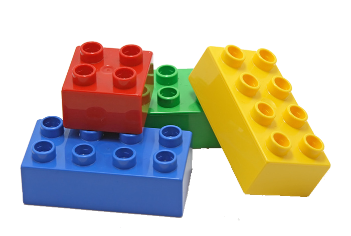
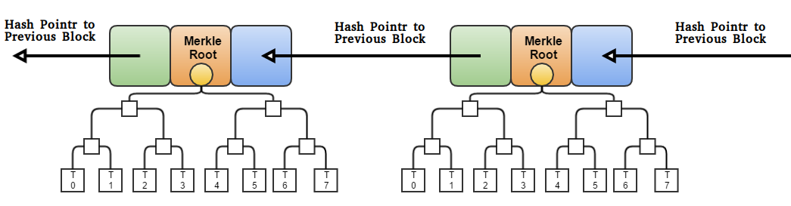
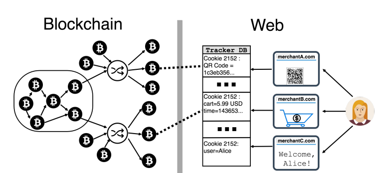
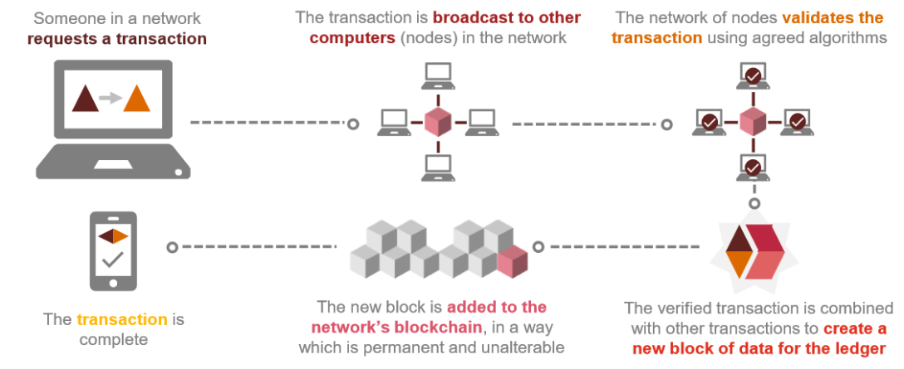
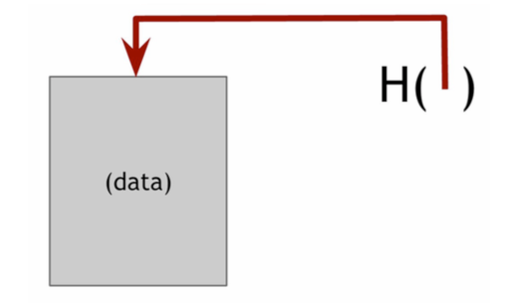
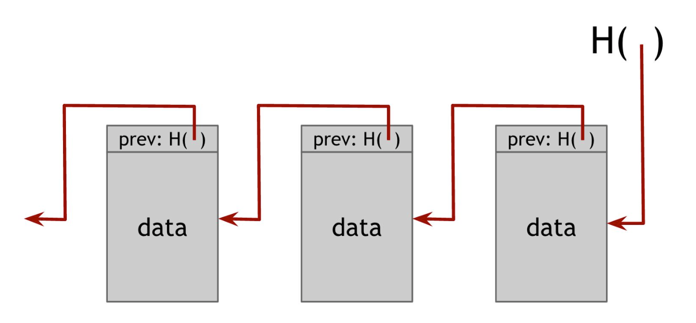
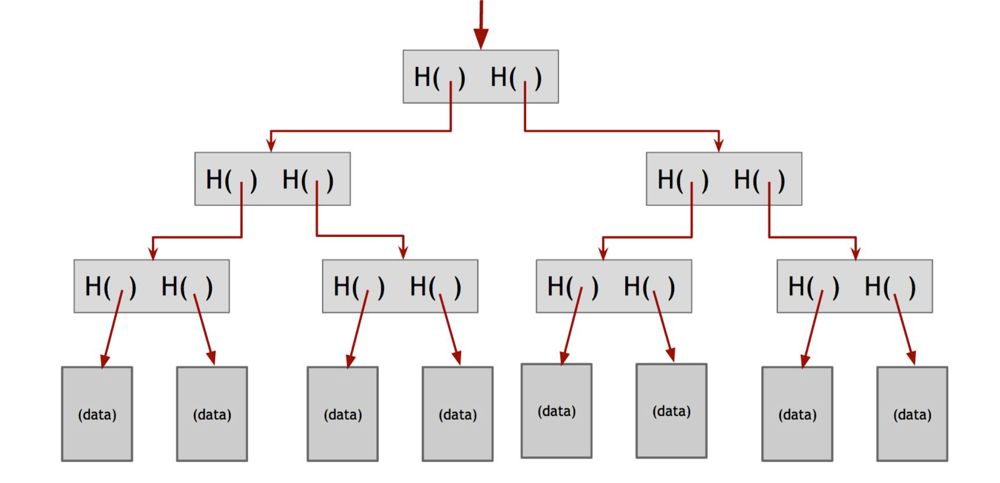

- title : Blockchain under the hood
- description : Fast paced introduction to the technologies underneath the Blockchain
- author : Stefano Paluello
- theme : night
- transition : default

***

- data-background : images/blockchainBckgW.jpg

# BLOCKCHAIN
## under the hood

 

A technical introduction to Blockchain 
 
for not (*so*) technical people

 
Stefano Paluello  [@21.co/palutz](https://21.co/palutz/)

***

### BUZZWORD AREA !!!

---

## Blockchain

#### Distributed Ledger Tech.

### Bitcoin

### Ethereum

###### Smart Contract

##### Token

#### ICO 

### ...

---

## Result?

 

***

## Blockchain

Definition(s) ( *from Wikipedia* )

A blockchain is a continuously growing list of records, called blocks, which are linked and secured using cryptography.

 

A blockchain can serve as "an open, distributed ledger that can record transactions between two parties efficiently and in a verifiable and permanent way."

 

 

PS: it's a pretty "old" concept (despite the recent hype) you can track it back to a paper by Haber and Stornetta in 1991

[//]: # "For use as a distributed ledger a blockchain is typically managed by a **peer-to-peer** network collectively adhering to a **protocol** for validating new blocks.)"

---

## Still ... ?

 

***

## Let's come back to...

 

 

## the basics !!!

---

### Basics 1

 

### Asset
  Everything (physical or virtual) that we own and could be exchanged.

 

### Transaction
  The action of changing assets ownership

---

### Basics 2

 

### Contract
  Set of rules and conditions used with transactions

### Ledger
  Book-keeping track of everything happening in our system 

### Intermediary
  A, eventually, third party facilitating or witnessing the transaction

---

### A step further...

### Distributed ledger
  The effort to collect transactions is distributed across different trusted parties

  We need a way to protect and keep updated all the ledgers and to incentivize good behavior amongst the parties

---

### Step by step...

---

 

---

### The Bitcoin Blockchain

 

PS: Don't be scared! We will use it just as an example of a ditributed PUBLIC Blockchain

---

 

(credit: MIT Technology Review)

***

---

### How Blockchain works... 

 
(credit: PwC)

---

## Key concepts

- Cryptographic functions and hash data structure
- Decentralised protocol
- Distributed ledger (P2P network)

---

### Network types
(Centralized, Distributed, Decentralized)

The main benefit of decentralized networks is the absence of a single point of failure.

---

## Hash and crypto

 

 

 

#### Disclaimer:
this is the tricky part

---

***

### Hash function

*Hash* function is a mathematical function with 3 properties:

- Input can be ANY size

- It produces a fixed size output (eg. 256 bit)

- It's efficiently computable (eg. O(n))

  
 

PS: math function = I don't need to trust someone. It's just MATH!

---

### Cryptographic Hash function

A *Cryptographic Hash* function has 3 additional feature:

- Collision resistance

- Hiding

- Puzzle-friendly

---

### Here we go again... 

 

---

### Please

 

---

## Let me explain
  
 

### Collision resistance 

 

It's INFEASIBLE to find two values with the same hash
  
 

with SHA-256 we need to try 2^130 random inputs to achieve a 99.8% chance that at least 2 items will collide

**Application**: message digest 

---

## Let me explain 2

 

### Hiding
  
 

There is no FEASIBLE way to understand the input (x) of a **hash** function H from its output (or cypher Y)
  
 

**Application**: commitment. Committing to a value or a message.

' A commitment is the digital analog of taking a value, sealing it in an envelope, and putting that envelope out on the table where everyone can see it.

---

## Let me explain 3

 

### Puzzle friendly
  
 

This is the most complicated one.
Simple explanation: if someone wants to target our hash function to “force” an output, or to produce a predetermined value, there is no other way than trying all the possible inputs.

**Application**: Search puzzle. 

' a mathematical problem which requires searching a very large space in order to find the solution. In particular, a search puzzle has no shortcuts.

 

***

## Hash Data structure

 

How we store data using our cryptohash functions

 

---

### Hash Data pointer

 

A hash pointer is simply a pointer to where some information is stored together with a cryptographic hash of the information

 

' a regular pointer gives you a way to retrieve the information
' a hash pointer also gives you a way to verify that the information has not changed.

---

### Block chain

 

A block chain is “simply” a linked list using hash pointers

 

' This data structure is tamper-evident 

---

### Merkle Tree

 

A binary tree with hash pointer is called Merkle Tree

 

' Proof of membership: with a Merkle tree it's quite easy to have a concise proof of membership (not feasible with the bock chain). It's enough to check a log(n) node to verify if a node is part of the tree.

---

Merkle Tree and block chain. Remember anything?

 

### The Blockchain!

***

## Benefits of Blockchain

- **Immutability** – A third party cannot make any changes to data.
- **Corruption & tamper proof** – Apps are based on a network formed around the principle of consensus, making censorship infeasible.
- **Secure** – No central point of failure and secured using cryptography, applications are well protected against hacking attacks and fraudulent activities.
- **Zero downtime** – Apps never go down and can never be switched off (sort of).

---

## Downsides

- write decentralized app is a bit tricky: quite new theory, not so much experience, lack of proper/stable tools.
- smart contracts could be faulty or buggy (DAO hack, ICO hack, ...)
- if a mistake is made there is no other way to correct it ithan with a Harf Fork.

